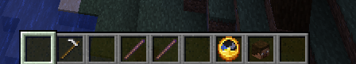

# ModUtils

## Description

Plugin Minecraft qui permet d'ajouter des outils utiles pour la modération.

## Doc 

### Commandes

`/modt`
- Donne des outils de modération pour tester des joueurs.
- Contenu :

- houe en fer : se rendre visible/invisible (clic droit)
- baton 1 : stick en baton qui a l'enchantement Knockback au niveau 1 (clic gauche sur le joueur)
- baton 2 : stick en baton qui a l'enchantement Knockback au niveau 2 (clic gauche sur le joueur)
- horloge : donne le nombre de CPS (clic par seconde) (10s d'attente) (clic droit sur le joueur)
- tête de Steve : donne les informations sur le joueur (clic droit sur le joueur)

### Permissions

- modutils.modt